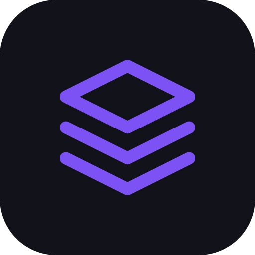

<p align="center">
  
</p>

<h1 align="center">DevHub</h1>

<p align="center">A cross-platform developer control plane.</p>

---

DevHub is a Tauri v2 desktop application that manages project state, AI agent sessions (OpenCode and Claude), MCP server lifecycles, resource visibility, and a reusable prompt skill library. It targets developers working across multiple projects who want a single interface to coordinate agent sessions, running services, and environment context.

## Features

- Project management with automatic detection of git repositories, docker-compose files, and `.env` files
- AI agent sessions via OpenCode (HTTP/SSE against a local `opencode serve` instance) and Claude (Agent SDK) with session persistence and resumption across app restarts
- File watcher (`notify`) that reactively updates project state on filesystem changes
- MCP server registry with per-project process lifecycle management; servers are injected into agent sessions at creation time
- Prompt skill library with project-scoped and global skills, injectable into agent sessions
- Directory tree viewer per project

**Planned (not yet shipped):**
- Resources panel: Docker containers (bollard), local port scanner, database connections, cloud CLI integration, env/secrets manager
- MCP server process spawning (registry UI exists; process spawner is stubbed)
- Global search

## Installation

### Download

Pre-built binaries are not yet available. Build from source below.

### Build from source

**Prerequisites:** Rust (stable), Bun

```bash
git clone https://github.com/mishalajmi/devhub.git
cd devhub
bun install
bun run tauri dev
```

## Tech Stack

| Layer | Technology |
|---|---|
| Desktop shell | Tauri v2 |
| Frontend framework | React 19 + TypeScript |
| Build tool | Vite 7 |
| Styling | Tailwind CSS v4 + shadcn/ui |
| State management | Zustand |
| Async data | TanStack Query v5 |
| Terminal rendering | xterm.js (@xterm/xterm) |
| Icons | lucide-react |
| Rust DB | rusqlite (bundled SQLite) |
| Rust migrations | rusqlite_migration |
| Docker API | bollard |
| File watching | notify |
| Process/PTY | std::process + portable-pty |
| Sidecar runtime | Node.js 20+ |
| OpenCode IPC | @opencode-ai/sdk (HTTP/SSE) |
| Claude IPC | @anthropic-ai/claude-agent-sdk |

## Development

```bash
# Frontend only
bun run dev

# Full app (frontend + Rust backend)
bun run tauri dev

# Type check
bun run typecheck

# Lint
bun run lint

# Rust build only
cd src-tauri && cargo build
```

## Project Structure

```
devhub/
├── src-tauri/                    # Rust backend (Tauri v2)
│   ├── src/
│   │   ├── main.rs               # Binary entry point
│   │   ├── lib.rs                # Library root — wires plugins + commands
│   │   ├── commands/             # Tauri command handlers (one file per domain)
│   │   ├── db/                   # SQLite setup and migrations
│   │   └── services/             # Business logic (docker, port scanner, file watcher, process)
│   ├── capabilities/
│   ├── Cargo.toml
│   └── tauri.conf.json
│
├── src/                          # React frontend
│   ├── components/
│   │   ├── ui/                   # shadcn/ui primitives
│   │   ├── layout/               # AppShell, Sidebar, TabBar, StatusBar
│   │   ├── agents/               # AgentPanel, TerminalView, SessionList
│   │   ├── resources/            # DockerPanel, ServicesPanel, DbPanel, CloudPanel, EnvPanel
│   │   ├── mcp/                  # McpRegistry, McpServerCard, McpStatusBadge
│   │   └── skills/               # SkillLibrary, SkillEditor, SkillCard
│   ├── stores/                   # Zustand stores (one per domain)
│   ├── hooks/                    # Custom React hooks
│   ├── lib/                      # Tauri invoke wrappers, agent clients, utilities
│   └── types/                    # Shared TypeScript types
│
└── sidecar/                      # Node.js sidecar — IPC bridge for OpenCode and Claude SDKs
```

## Contributing

Fork the repository, create a branch off `main`, and open a pull request with a clear description of the change. See `AGENTS.md` for architecture, code style, and conventions.
